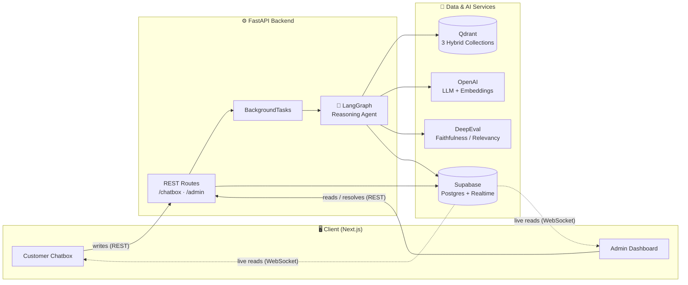
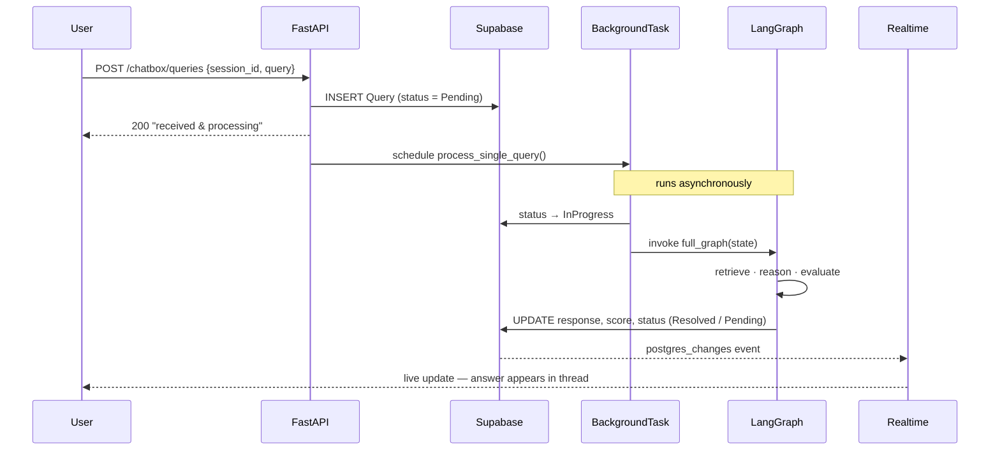
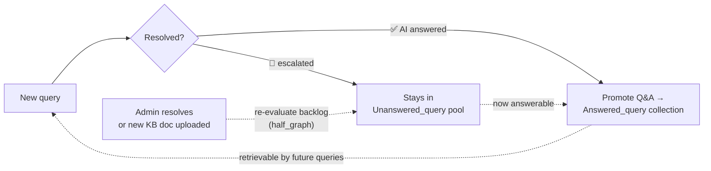

<div align="center">

# 🤖 AI-Powered Customer Support Agent

**A context-aware RAG + Agent system that triages incoming support requests, resolves common issues autonomously, and escalates edge cases to humans with a complete context hand-off.**

<!-- ░░░ DEPLOYMENT LINKS — update the URLs after deploying ░░░ -->
[](#)
[](#)

<sub>Deployment URLs are intentionally left blank — replace the `(#)` targets above once the apps are hosted.</sub>

<br/>


</div>

---

## 📋 Table of Contents

- [The Problem](#-the-problem)
- [How This Solves the Objective](#-how-this-solves-the-objective)
- [System Architecture](#-system-architecture)
- [🧠 Agent Orchestration Flow (LangGraph)](#-agent-orchestration-flow-langgraph)
- [Backend Deep Dive](#-backend-deep-dive)
  - [1. Request Lifecycle](#1-request-lifecycle)
  - [2. The Reasoning Graph — Node by Node](#2-the-reasoning-graph--node-by-node)
  - [3. Retrieval (RAG): Three Qdrant Collections](#3-retrieval-rag-three-qdrant-collections)
  - [4. Confidence Scoring & Escalation](#4-confidence-scoring--escalation)
  - [5. Multi-Turn Memory](#5-multi-turn-memory)
  - [6. The Self-Improving Knowledge Loop](#6-the-self-improving-knowledge-loop)
  - [7. Query Status Lifecycle](#7-query-status-lifecycle)
- [API Reference](#-api-reference)
- [Data Model](#-data-model)
- [Tech Stack](#-tech-stack)
- [Project Structure](#-project-structure)
- [Getting Started](#-getting-started)
- [Deployment](#-deployment)

---

## 🎯 The Problem

> Support teams spend **60–80%** of their time answering the same ~20 questions. The system must **triage** incoming requests, **resolve** common issues autonomously, and **escalate** edge cases with a complete context summary — so the human agent does not need to re-read the entire thread.

This project replaces Tier-1 support with a multi-turn AI agent built on **RAG over a product knowledge base**, **confidence-based escalation**, a **live threaded chat UI**, and an **admin analytics panel** — all backed by real, persisted data.

---

## ✅ How This Solves the Objective

Each core requirement from `Objective.md` maps directly to an implemented backend mechanism:

| Objective Requirement | How it's implemented | Where |
| :--- | :--- | :--- |
| **RAG Knowledge Base** — ingest PDF / Markdown / URL, embed & retrieve relevant chunks | Documents are chunked, embedded (`text-embedding-3-small`) and stored in the **`Service_files`** Qdrant collection; retrieved via **hybrid search (dense + BM25, RRF fusion)** | `services/DataBases/Qdrant/service_files.py`, `admin/admin_service.py` |
| **Multi-Turn Memory** — reference earlier turns without repetition | Per-session history is injected (`inject_chat_node`), follow-ups answered from context (`ans_with_chat_node`), and ambiguous queries rewritten into standalone form (`transform_query_node`) | `services/Graph/nodes/` |
| **Confidence & Escalation** — escalate when retrieval confidence is low / out of scope, with structured hand-off | Every candidate answer is scored by **DeepEval** (Faithfulness ≥ 0.90, Answer-Relevancy ≥ 0.95). Failing answers route to `escalate_node` → status `Pending` → admin queue, with the **full session context** available to the human | `nodes/tools/evaluator.py`, `nodes/escalate.py`, `admin_route.py` |
| **Live Chat UI** — threaded states, AI-vs-human distinction | Threaded query↔response UI with an "Under evaluation" pending state and live updates (Supabase Realtime) | `Frontend/` |
| **Admin Analytics Panel** — volume, resolution rate, unanswered patterns, escalation frequency | Postgres analytics RPCs surfaced through `/admin/*` and rendered as a real-data dashboard | `admin_route.py`, `Frontend/app/admin/` |
| **Feedback Loop** — 👍/👎 queues responses for KB review | `review` field per query; negative feedback exposed via `/admin/feedback/negative` | `chatbox_route.py`, `admin_route.py` |
| **KB updates reflect in agent answers** | Resolved answers are promoted into the **`Answered_query`** collection (retrievable past tickets); the escalation pool can be re-evaluated against the updated KB via `process_unanswered_queries_batch()` | `nodes/answer.py`, `graph_service.py` |

---

## 🏗 System Architecture



**Key design decision — write/read split:** the browser **writes** through FastAPI (the source of truth & business logic) but **reads live** by subscribing directly to Supabase Realtime. FastAPI processes each query in a `BackgroundTask` and writes the result back to Postgres later; Supabase then *pushes* the update to the client — no polling, no socket held open by the API.

---

## 🧠 Agent Orchestration Flow (LangGraph)

The heart of the backend is a **LangGraph state machine** (`full_graph`). When a query arrives it walks a deterministic path of nodes, each one a focused step that can short-circuit to an answer or fall through to the next strategy.

```text
 ══════════════════════════════════════════════════════════════════════════════════════════════
                   AI CUSTOMER SUPPORT AGENT  —  END-TO-END ORCHESTRATION
 ══════════════════════════════════════════════════════════════════════════════════════════════

                          ┌──────────────────────────────────────┐
                          │ CLIENT  (Next.js)                    │
                          │ Chatbox   |   Admin Dashboard        │
                          └──────────────────────────────────────┘
                                              │
      (1) POST /chatbox/queries  {session_id, query}
                                              ▼
                          ┌──────────────────────────────────────┐
                          │ FASTAPI                              │
                          │ - INSERT Query  (status = Pending)   │
                          │ - schedule BackgroundTask            │
                          └──────────────────────────────────────┘
                                              │
      (2) process_single_query()  ->  status = InProgress
                                              ▼
 ══════════════════════   LANGGRAPH  STATE  MACHINE  ·  full_graph   ══════════════════════════

                          ┌──────────────────────────────────────┐
                          │ [1] inject_chat_node  ·  build memory│
                          └──────────────────────────────────────┘
                                              │
                                              ▼
                          ┌──────────────────────────────────────┐
                          │ [2] ans_with_chat_node  ·  chat-only │ ─►  [6] answer (if solved)
                          └──────────────────────────────────────┘
                                              │  no answer  ->  need knowledge
                                              ▼
                          ┌──────────────────────────────────────┐
                          │ [3] transform_query  ·  standalone Q │
                          └──────────────────────────────────────┘
                                              │
                                              ▼
  ┌────────────────────┐  ┌──────────────────────────────────────┐    ┌──────────────────────┐
  │ QDRANT (hybrid)    │  │ [4] main_agent_node  (ReAct + RAG)   │    │ SUPABASE POSTGRES    │
  │ dense+BM25 · RRF   │─►│     tool A · search Answered         │───►│ User·Session·Query   │
  │ - Service_files    │  │     tool C · search Service docs     │    │ (source of truth)    │
  │ - Answered_query   │  └──────────────────────────────────────┘    └──────────────────────┘
  │ - Unanswered_query │                      │
  └────────────────────┘                      ▼
                          ┌──────────────────────────────────────┐
                          │ [5] DeepEval gate (confidence)       │
                          │     Faithful >=.90 · Relevant >=.95  │
                          └──────────────────────────────────────┘
                                              │
             ┌────────────────────────────────┤
    score=0  │                                │  score>0
             ▼                                ▼
  ┌────────────────────┐  ┌──────────────────────────────────────┐
  │ [7] escalate_node  │  │ [6] answer_node                      │
  │ status = Pending   │  │ - status = Resolved + score          │
  └────────────────────┘  │ - promote Q&A -> Answered_query      │
             │            │ - delete <- Unanswered_query         │
             │            └──────────────────────────────────────┘
             │              writes -> Supabase -> Realtime -> user (live)
             │  human queue
             │
             ▼
 ══════════════════════════════════════════════════════════════════════════════════════════════
    ┌──────────────────────────────────────────────────────────────────────────────────────┐
    │ HUMAN-IN-THE-LOOP  ·  Admin Dashboard                                                │
    │ Escalation queue (Pending) -> POST /admin/resolve -> "resolved"                      │
    │                                                                                      │
    │ SEMANTIC CASCADE: process_unanswered_queries_batch() -> half_graph                   │
    └─dense-search Unanswered -> re-run RAG -> auto-resolve -> Answered────────────────────┘
```

**Why two answer attempts before escalating?**
1. `ans_with_chat_node` handles cheap **follow-ups** (e.g. *"and how much does that cost?"*) directly from conversation memory — no retrieval needed.
2. `main_agent_node` handles **knowledge questions** via RAG. Only if *both* strategies fail their confidence checks does the query escalate to a human.

> There is also a lighter **`half_graph`** (`main_agent → answer/END`) used to **re-evaluate the backlog** of escalated queries against a freshly-updated knowledge base.

---

## 🔬 Backend Deep Dive

### 1. Request Lifecycle



The POST returns **immediately**; the heavy RAG + evaluation work happens in the background, and the answer lands in the user's thread via Realtime whenever it's ready.

### 2. The Reasoning Graph — Node by Node

| Node | Responsibility | Notable details |
| :--- | :--- | :--- |
| `inject_chat_node` | Reconstruct the conversation history for the session **up to** the current query | Feeds memory to downstream nodes |
| `ans_with_chat_node` | Attempt an answer using **only** chat history | LLM with structured `AgentResponse`; gated by DeepEval |
| `transform_query_node` | Rewrite a context-dependent query into a **standalone** question | Persists `transform_query`; indexes it into the **Unanswered** pool |
| `main_agent_node` | **ReAct agent** (`create_react_agent`) with two RAG tools | Returns a response *only when confident*; each tool capped at 7 calls |
| `evaluate` (tool) | **DeepEval** scoring — Faithfulness ≥ 0.90 **and** Answer-Relevancy ≥ 0.95 | Returns relevancy score on pass, else `0` (→ no answer) |
| `answer_node` | Persist `response + score + status='Resolved'`; promote the Q&A into the **Answered** collection; remove it from the **Unanswered** pool | This is what makes the KB *self-improving* |
| `escalate_node` | Mark `status='Pending'` so the admin escalation queue picks it up | Prevents queries from being stranded mid-processing |

**Agent tools** (`main_agent_node`):
- `get_file_data` → hybrid search over **`Service_files`** (ingested product docs / FAQs).
- `get_answered_query` → hybrid search over **`Answered_query`** (previously resolved tickets) → returns IDs → full Q&A fetched from Postgres.

### 3. Retrieval (RAG): Three Qdrant Collections

The system maintains **three** purpose-built vector collections (all OpenAI `text-embedding-3-small`, 1536-dim, cosine):

| Collection | Contents | Search | Used by |
| :--- | :--- | :--- | :--- |
| **`Service_files`** | Chunked product docs / FAQs / tickets (PDF · MD · URL) | **Hybrid** — dense + BM25 sparse, fused with **RRF** | `get_file_data` tool |
| **`Answered_query`** | Standalone form of every **resolved** query | **Hybrid** (dense + BM25, RRF) | `get_answered_query` tool |
| **`Unanswered_query`** | Standalone form of **in-flight / escalated** queries | **Dense** (threshold 0.5) | Backlog re-evaluation |

> **Hybrid search** = semantic recall (dense embeddings) **+** exact keyword precision (BM25 sparse), combined via **Reciprocal Rank Fusion** — so the agent finds both *"how do I rotate my key"* and a literal *"401 Unauthorized"*.

### 4. Confidence Scoring & Escalation

Every candidate answer — from *both* answer nodes — is independently judged by **DeepEval** against its retrieved context:

```text
FaithfulnessMetric(threshold=0.90)     → is the answer grounded in retrieved data?
AnswerRelevancyMetric(threshold=0.95)  → does it actually address the question?

pass(both)  → score = relevancy   (answer is trusted, status = Resolved)
fail(either)→ score = 0           (answer discarded → escalate to human)
```

This is the **"resolve vs. escalate" gate**: the agent is explicitly instructed to *return nothing* when unsure, and the evaluator is the safety net that catches plausible-but-ungrounded answers before they reach the customer. Escalated queries land in the admin queue with their **full conversation context** (`GET /admin/session/{id}/context`) for a clean human hand-off.

### 5. Multi-Turn Memory

Memory is **session-scoped** and reconstructed per request (`inject_chat_node`), not just passed as raw history:
- Follow-up questions are answered straight from context (`ans_with_chat_node`).
- Ambiguous references ("*that plan*", "*it*") are resolved into standalone queries before retrieval (`transform_query_node`), so RAG always searches with a self-contained question.
- LangGraph is invoked with `thread_id = session_id`, keeping each conversation isolated.

### 6. The Self-Improving Knowledge Loop



- Each resolved answer becomes **retrievable knowledge** for the next customer (past-ticket RAG).
- When the KB is enriched (admin uploads a doc, or a human resolves an escalation), the **unanswered pool** can be re-run against the new knowledge via `process_unanswered_queries_batch()` and promoted automatically — closing the loop toward the *"KB updates reflect within 60 seconds"* goal.

### 7. Query Status Lifecycle

```text
                ┌──────────────► Resolved  (AI answered, evaluator passed)
  Pending ──► InProgress ──┤
   (new)     (graph runs)  └──────────────► Pending   (escalated → human queue)
                                               │
                              admin /resolve ──┴──► Resolved (status "resolved")
```

> Note: AI resolutions write status **`Resolved`**; human/admin resolutions write **`resolved`** (lowercase). Analytics & UI compare status **case-insensitively** to count both.

---

## 🔌 API Reference

### Chatbox (`/chatbox`)
| Method | Endpoint | Purpose |
| :--- | :--- | :--- |
| `POST` | `/users` | Create a user |
| `POST` | `/login` | Authenticate, return user data |
| `GET` | `/users/{user_id}/sessions` | List a user's sessions |
| `POST` | `/sessions` | Create a session |
| `GET` | `/sessions/{session_id}/queries` | All queries in a session (the thread) |
| `POST` | `/queries` | Submit a query (processed in background) |
| `POST` | `/queries/{query_id}/review` | Submit 👍 / 👎 feedback |

### Admin (`/admin`)
| Method | Endpoint | Purpose |
| :--- | :--- | :--- |
| `GET` | `/analytics` | Totals, resolved, escalated, resolution rate (date-rangeable) |
| `GET` | `/unanswered` | Escalation queue (unanswered queries) |
| `POST` | `/resolve` | Human resolution of an escalated query |
| `GET` | `/feedback/negative` | 👎 responses for KB review |
| `GET` | `/session/{session_id}/context` | Full conversation context (hand-off) |
| `POST` | `/knowledge-base/upload` | Ingest a Markdown / Text / **PDF** file |
| `POST` | `/knowledge-base/url` | Scrape & ingest a URL |

Interactive docs available at **`/docs`** (FastAPI Swagger UI) when the server is running.

---

## 🗄 Data Model

Persisted in **Supabase Postgres** (accessed through SQL RPC functions):

| Table | Key fields |
| :--- | :--- |
| `User` | `user_id`, `name`, `email`, `password` |
| `Session` | `session_id`, `user_id`, `created_at` |
| `Query` | `query_id`, `session_id`, `query`, `transform_query`, `response`, `review`, `status`, `score`, `created_at` |

The `Query` row holds **both sides of the exchange** (the question and its eventual answer) plus the confidence `score` and `status` — this single shape drives the threaded UI, the analytics, and the escalation queue.

---

## 🧰 Tech Stack

**Backend**
- **FastAPI** + Uvicorn — async REST API & background processing
- **LangGraph** + **LangChain** — agent state machine & ReAct agent
- **OpenAI** — LLM (`create_react_agent`) + `text-embedding-3-small`
- **Qdrant** (cloud inference) — hybrid (dense + BM25/RRF) vector search across 3 collections
- **DeepEval** — Faithfulness & Answer-Relevancy confidence gating
- **Supabase** (Postgres + Realtime) — persistence & live updates
- **pypdf / BeautifulSoup / langchain-text-splitters / tiktoken** — document ingestion

**Frontend**
- **Next.js (App Router)** + TypeScript + Tailwind CSS
- **Supabase JS** (Realtime), **TanStack Query**, **Framer Motion**

---

## 📁 Project Structure

```
Customer_Support_Agent/
├── Backend/
│   ├── main.py                     # FastAPI app + CORS + routers
│   ├── requirements.txt
│   └── app/
│       ├── models/                 # Pydantic schemas (supabase, admin, graph, chunking)
│       ├── routes/
│       │   ├── chatbox_route.py     # user-facing endpoints
│       │   └── admin_route.py       # admin endpoints
│       └── services/
│           ├── Chatbox/             # chatbox orchestration
│           ├── Admin/               # analytics + KB ingestion
│           ├── Graph/
│           │   ├── graph.py         # ⭐ full_graph + half_graph definitions
│           │   ├── graph_service.py # graph invocation (background)
│           │   └── nodes/           # inject_chat · ans_with_chat · transform_query
│           │       ├── main_agent.py      #   · main_agent (ReAct) · answer · escalate
│           │       └── tools/             # get_file_data · get_answered_query · evaluator
│           └── DataBases/
│               ├── Supabase/         # Postgres client + RPC wrappers
│               └── Qdrant/           # 3 collections + chunking
├── Frontend/                        # Next.js chat + admin dashboard
└── Sample_Support_Docs/             # demo knowledge-base documents
```

---

## 🚀 Getting Started

### Prerequisites
- Python 3.12+, Node.js 18+
- Accounts/keys: **OpenAI**, **Qdrant Cloud**, **Supabase**

### 1. Backend

```bash
cd Backend
python -m venv myenv && source myenv/bin/activate
pip install -r requirements.txt
```

Create `Backend/.env`:

```env
OPENAI_API_KEY=sk-...
model=gpt-4o-mini          # any chat model id passed to ChatOpenAI

SUPABASE_URL=https://<project>.supabase.co
SUPABASE_KEY=<service-role-key>

QDRANT_URL=https://<cluster>.qdrant.io
QDRANT_API_KEY=<qdrant-key>
```

> **Supabase setup:** the backend calls Postgres **RPC functions** (e.g. `get_session_queries`, `update_query_response_score_status`, `admin_get_analytics_summary`, `admin_get_top_unanswered_questions`, `admin_resolve_query`, …). Create the `User` / `Session` / `Query` tables and these functions in the SQL editor. To enable live updates, add the `Query` table to the `supabase_realtime` publication and grant the anon role read access.

Run it:

```bash
uvicorn main:app --reload      # http://127.0.0.1:8000  (docs at /docs)
```

The three Qdrant collections (`Service_files`, `Answered_query`, `Unanswered_query`) are **auto-created on first import**.

### 2. Frontend

```bash
cd Frontend
npm install
cp .env.local.example .env.local   # set API URL + Supabase anon key
npm run dev                         # http://localhost:3000
```

### 3. Load the knowledge base
Open the **Admin → Knowledge base** page (or `POST /admin/knowledge-base/upload`) and ingest the docs in `Sample_Support_Docs/`. The agent can answer from them within seconds.

---

## 🌐 Deployment

> _Deployment targets are intentionally left blank — fill these in once hosted._

| Component | Platform | URL |
| :--- | :--- | :--- |
| **Frontend** | _TBD (e.g. Vercel)_ | `⬛ <add-url>` |
| **Backend** | _TBD (e.g. Render / Railway / Fly)_ | `⬛ <add-url>` |

**Checklist when deploying the backend:**
- Set all environment variables from `Backend/.env`.
- Tighten CORS in `main.py` (currently `allow_origins=["*"]`) to the frontend domain.
- Point the frontend's `NEXT_PUBLIC_API_URL` at the deployed backend.

---

<div align="center">
<sub>Built as an AI-powered Tier-1 support replacement · RAG + Agents + confidence-based escalation.</sub>
</div>
